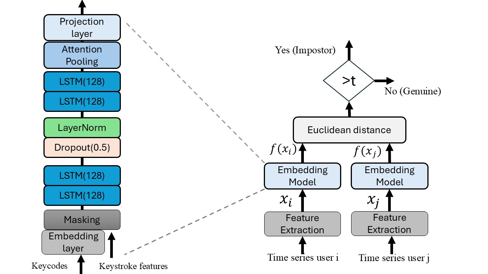

# TypePlus: A Deep Learning Architecture for Keystroke Authentication with Loss Function Evaluation

## Table of Contents
1. [Dataset](#dataset-overview)
2. [Data Preprocessing](#data-preprocessing)
3. [Model Architecture](#model-architecture)
4. [Results](#results)
5. [Project Setup](#project-setup)
6. [Running the Experiment](#running-the-experiment)
   
TypePlus is a lightweight deep learning model for free-text keystroke authentication, evaluated across multiple loss functions, including a Filtered Mean Triplet Loss. It achieves state-of-the-art performance with a 2.86% Equal Error Rate (EER) on the Aalto University Keystroke Dataset, demonstrating its effectiveness in keystroke biometrics. 

## 1. Dataset 
TypePlus is trained and evaluated on the Aalto University Keystroke Dataset, which consists of keystroke data collected from 168,000 participants using physical keyboards (desktop or laptop). The keystroke events were recorded with millisecond precision using JavaScript functions, capturing both key press (keydown) and release (keyup) events in Coordinated Universal Time (UTC) format.

## 2. Data Preprocessing

Each keystroke sequence was processed to extract four temporal features, capturing the time relationships between consecutive keystrokes:  
1. **Hold Latency (HL):** Time elapsed between pressing and releasing the same key.  
2. **Inter-key Latency (IL):** Time between the release of one key and the press of the next key.  
3. **Press Latency (PL):** Time between two consecutive key press events.  
4. **Release Latency (RL):** Time between two consecutive key release events.  

These features were computed for each keystroke pair and converted from **milliseconds to seconds** to ensure consistency in time representation. Unlike previous studies that treated keycodes as numerical values or categorical features, we **treated keycodes as embeddings**. Each unique key was mapped to a **learnable dense representation**, allowing the model to capture meaningful relationships between frequently used key pairs.  

## 3. TypePlus Architecture 

The proposed TypePlus architecture is designed as an improvement for TypeNet architecture. The model consists of multiple layers, including Long ShortTerm Memory (LSTM) networks, attention pooling, and a projection layer that generates meaningful representations for each user’s keystroke dynamics. The figure below illustrates the overall architecture of TypePlus.

After preprocessing, we obtain five features: keycodes and four temporal feature series. The transformed input is then fed into a TypePlus embedding model comprising several key components. First, an Embedding Layer maps input keycodes into dense vector representations, allowing the model to more effectively capture spatial relationships between different keycodes. For sequences with lengths N > M, we truncate the input to fit within M. Conversely, when N < M, we apply zero-padding at the end of the sequence until it reaches M. The Masking mechanism ensures that these padded values are ignored during training. The model employs a hierarchical LSTM architecture, consisting of two sequential bidirectional LSTM layers, each with 128 hidden units per direction (256 total per layer due to bidirectionality).

A critical component of the architecture is the Attention Pooling mechanism, which enables the model to dynamically focus on the most relevant keystroke features. This mechanism is implemented using a fully connected attention layer that assigns importance scores to each time step in the sequence. Given an input sequence x, the attention scores αt are computed as follows:

  
  

  

These scores are then applied to the **LSTM outputs** to compute a weighted sum:  

  
  

  

### Verification scheme

The Euclidean distance between keystroke embeddings is calculated as:  

  
  

  

where a **lower distance** indicates a **higher similarity**. A threshold **\( t \)** is applied for classification:  

- If **\( d < t \)** → **Genuine User**  
- If **\( d \geq t \)** → **Impostor**  
